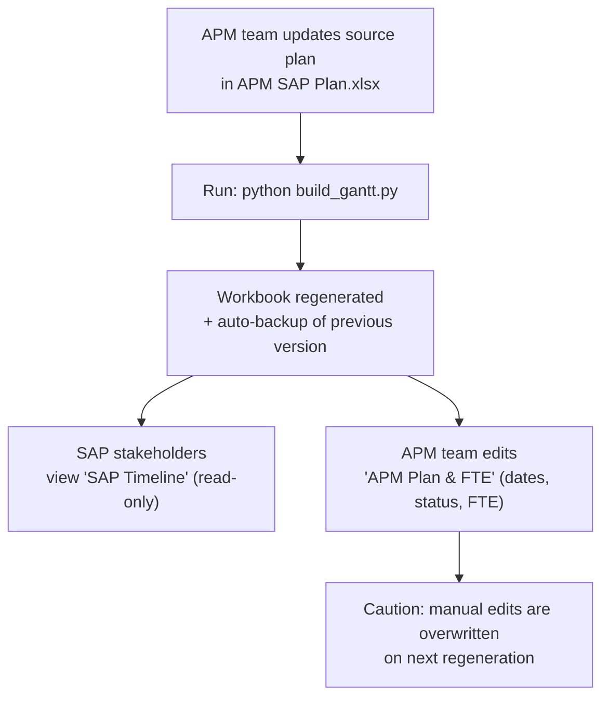
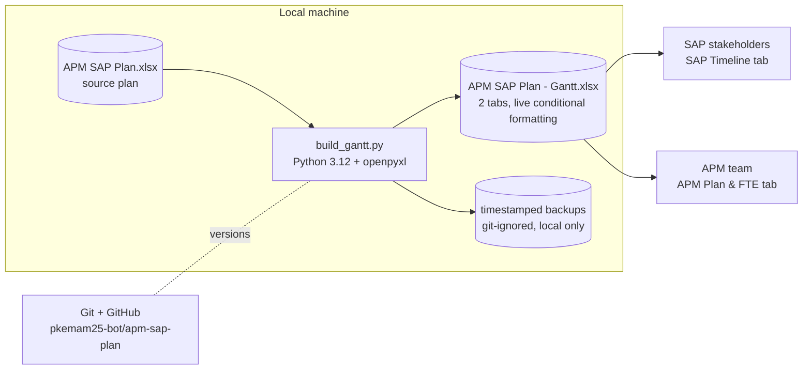
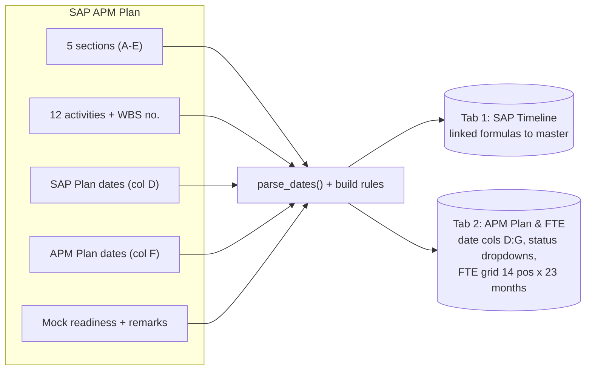

# PROJECT — APM SAP Plan

Last updated: 11 Sep 2026 | Current version: **v1.1.0**

## 1. Overview

Planning hub for the **APM - SAP Activity & Support** workstream supporting the SAP ECC → S/4HANA migration (**Go-Live 1 Jul 2027**). Generates a professional two-tab Excel workbook: a read-only `SAP Timeline` for SAP stakeholders and an editable `APM Plan & FTE` master with dual-bar Gantt and a 14-position × 23-month FTE grid.

## 2. Version History

| Version | Date       | What we did (high level)                                                      | Tag  |
|---------|------------|-------------------------------------------------------------------------------|------|
| v1.0.0  | 2026-09-04 | Initial release: dual-bar weekly Gantt, live conditional formatting, FTE grid, auto-backups | v1.0.0 |
| v1.1.0  | 2026-09-11 | Repo sync: added scripts/, project-info/, wbs-templates/, timesheet-analysis/, README; updated Gantt workbook; added PROJECT.md charter | v1.1.0 |

## 3. SDLC Status (history view)

| Phase      | Status | Notes / Key artifacts                                  |
|------------|--------|--------------------------------------------------------|
| Analysis   | ✅ Done | Source plan ("SAP APM Plan" as of 27 Aug 2026) + FTE example analyzed |
| Design     | ✅ Done | Two-tab architecture (read-only view + editable master), documented in `version.md` |
| Implement  | ✅ Done | `build_gantt.py` builder; workbook generated            |
| Testing    | 🔶 Partial | Manual visual verification only — no automated tests |
| Deployment | ✅ Done | Manual local regeneration; workbook shared with stakeholders |

## 4. Deployment Information

- **Where:** local Windows machine (this repo); no server.
- **How:** `python build_gantt.py` — regenerates `APM SAP Plan - Gantt.xlsx` and auto-backs up the previous version (timestamped, local only, git-ignored).
- **Consumers:** SAP stakeholders (read-only `SAP Timeline` tab), APM team (`APM Plan & FTE` master tab).
- **Frequency:** regenerated when the source plan or dates change.

## 5. Technology Stack

- Python 3.12+, openpyxl (workbook generation)
- Excel features: conditional formatting, data validation dropdowns, date pickers, linked formulas
- Git + GitHub (pkemam25-bot/apm-sap-plan)

## 6. Key Files Map

| Path | Purpose |
|------|---------|
| `APM SAP Plan.xlsx` | Source plan (read-only input, never modified) |
| `APM SAP Plan - Gantt.xlsx` | Generated output workbook (also holds manual FTE values) |
| `build_gantt.py` | Builder script — generates the Gantt workbook |
| `version.md` | Detailed version log (features, seeding rules, assumptions) |
| `scripts/` | Historical helper scripts (charts, formulas, gantt fixes) |
| `project-info/` | Project Information source workbooks |
| `wbs-templates/` | APM WBS template workbooks (v4 variants) |
| `timesheet-analysis/` | Timesheet analysis scripts + TIME report data |

## 7. How to Run

```bash
cd apm-sap-plan
python build_gantt.py            # regenerate Gantt workbook
cd timesheet-analysis
python analyze_timesheet.py      # explore timesheet structure
python summarize_djc.py          # DJC hours summary (Apr-May)
```

## 8. Data Sources

- `APM SAP Plan.xlsx` — sheet "SAP APM Plan", *as of 27 Aug 2026: SAP Go Live 1 Jul 2027*
- FTE example (see `Example FTE Tracking.png`) — current FTE numbers are **mock samples**
- `timesheet-analysis/TIME_report_25_Aug.xlsx` — timesheet extract (Digital Job Card)

## 9. Known Issues & TODO

- ⚠️ FTE values are mock samples — replace with real numbers when available
- ⚠️ Several APM dates remain **TBC** (SIT/UAT/Business Sim, Ramp Down/Blackout/Ramp Up/Hypercare — pending SHANA confirmation)
- Regeneration **overwrites manual Excel edits** (e.g. typed FTE values) — bake changes into the script instead
- No automated tests for the builder
- Successor work: see repo `apm-revised-master-plan`

## 10. References

- Related repo: `apm-revised-master-plan` (revision of the master plan)
- Monorepo of origin: `vscode-projects`

## 11. Diagrams

### User Flow



### System Architecture



### Data Architecture



## 12. Implementation Plan & Priorities

| # | Step (high level) | Priority | End-to-end test / acceptance |
|---|-------------------|----------|------------------------------|
| 1 | Add unit tests for builder core (`parse_dates`, seeding rules, sheet structure) | P1 | `pytest` green; `python build_gantt.py` regenerates workbook that opens in Excel with both tabs, bars, FTE grid intact |
| 2 | Bake real FTE values into the script (replace mock samples) when provided | P1 | Total FTE row = sum of positions × months; spot-check against provided real data |
| 3 | Parameterize constants (GO_LIVE, grid start/end) via config or args | P2 | Run with a test GO_LIVE date → today marker & Go-Live block move correctly in regenerated file |
| 4 | Auto-refresh TBC dates once confirmed (edit source → regenerate) | P3 | Edit a source date → regenerated workbook reflects it; `SAP Timeline` linked cells stay in sync |
| 5 | Decide manual-edit policy (bake-in vs. protected columns) and document | P3 | Manual edits either survive regeneration or are explicitly listed as baked-in |

## 13. Testing Strategy

- **Unit tests:** written and run by Buffy — `pytest` + openpyxl assertions against the generated workbook (sheet names, key cells, FTE totals, conditional-formatting rule counts, dropdown validations). Location: `tests/`, run with `pytest`.
- **E2E verification:** after each step above — regenerate workbook, load with openpyxl, and open in Excel for visual check (bars, dropdowns, date pickers).
- **Rule:** a step is *done* only when its E2E acceptance passes and tests are green. Tag only from a green state.

---
*Maintained by the APM team. Update on every release/tag.*
